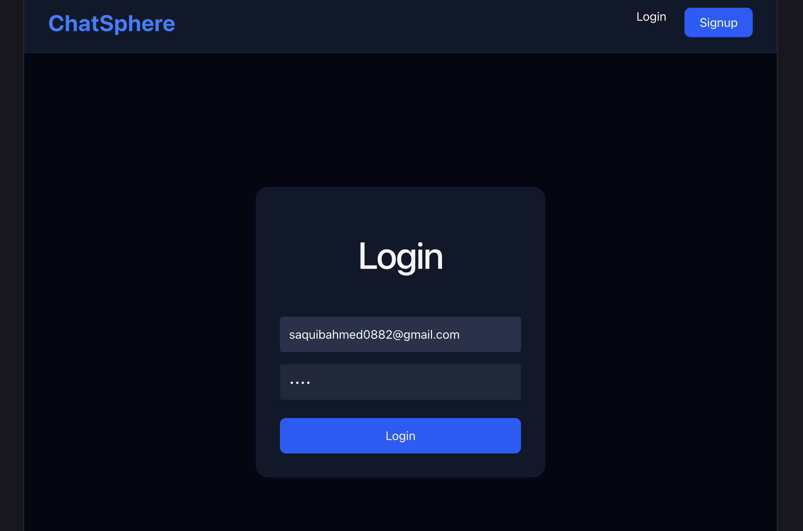
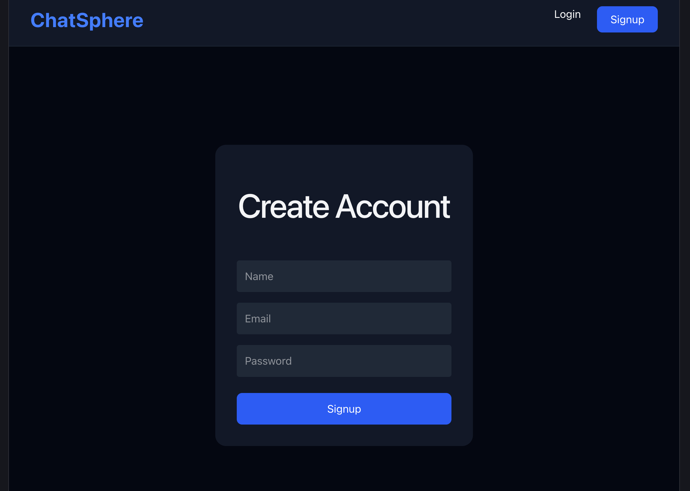
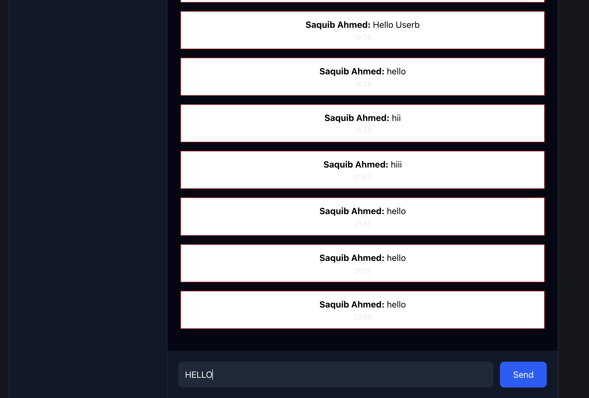
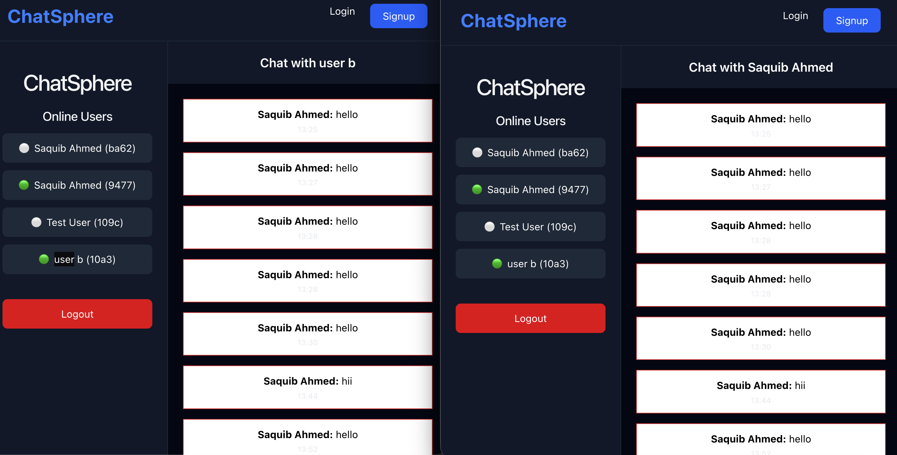
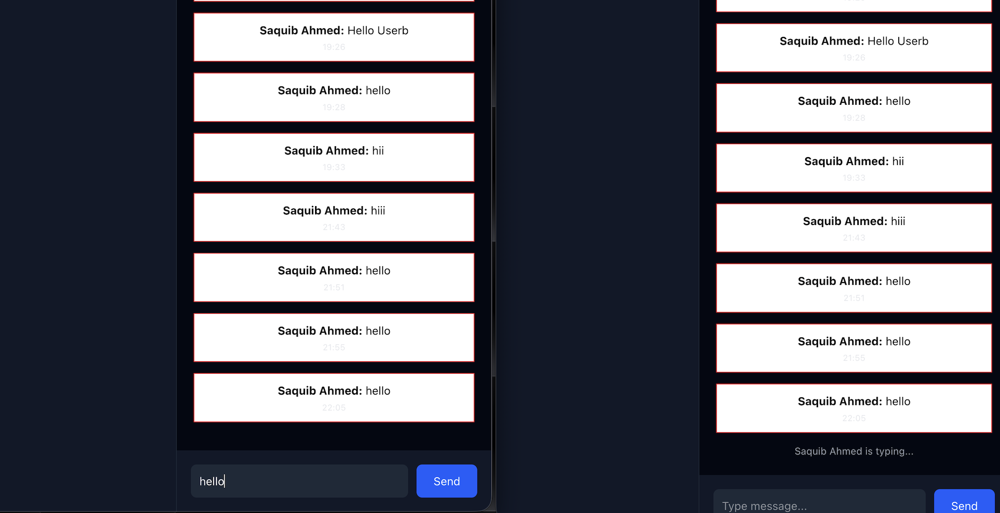

# 💬 ChatSphere

A modern **Full Stack Real-Time Chat Application** inspired by **iMessage**, built using the **MERN Stack**, **Socket.IO**, **JWT Authentication**, and **MongoDB**.

---

## 🚀 Features

- 🔐 User Authentication (Login & Signup)
- 💬 Real-Time Messaging with Socket.IO
- 🟢 Online / Offline User Status
- ⌨️ Typing Indicator
- 📜 Persistent Chat History
- 👤 User List
- ⚡ Fast and Responsive UI
- 🔒 JWT Authentication
- 🌐 MongoDB Database

---

## 🚀 Live Demo

- **Frontend:** https://chatsphere-pi.vercel.app
- **Backend API:** https://chatsphere-backend-518s.onrender.com

## ☁️ Deployment

- **Frontend:** Vercel
- **Backend:** Render
- **Database:** MongoDB Atlas

## 🛠 Tech Stack

### Frontend
- React.js
- Vite
- Tailwind CSS
- Socket.IO Client
- React Router

### Backend
- Node.js
- Express.js
- Socket.IO
- JWT Authentication
- bcrypt

### Database
- MongoDB Atlas
- Mongoose

---

## 📂 Project Structure

```
ChatSphere/
│
├── client/
│   ├── src/
│   ├── public/
│   └── package.json
│
├── server/
│   ├── controllers/
│   ├── models/
│   ├── routes/
│   ├── sockets/
│   ├── middleware/
│   └── server.js
│
├── .gitignore
├── README.md
└── package.json
```

---

## ⚙️ Installation

### Clone Repository

```bash
git clone https://github.com/saquibahmed0882/chatsphere.git
```

### Go to Project

```bash
cd chatsphere
```

### Install Dependencies

#### Client

```bash
cd client
npm install
```

#### Server

```bash
cd ../server
npm install
```

---

## ▶️ Run Application

### Start Backend

```bash
cd server
npm run dev
```

### Start Frontend

```bash
cd client
npm run dev
```

---

## 📸 Screenshots

### 🔐 Login Page



### 📝 Signup Page



### 💬 Chat Interface



### 🟢 Online Users



### ⌨️ Typing Indicator



---

## 🌟 Upcoming Features

- ✅ Message Seen Status
- 📁 File Sharing
- 😊 Emoji Picker
- 🖼 Image Sharing
- 🌙 Dark Mode
- 👥 Group Chat
- 🔔 Notifications
- 🎥 Audio & Video Calling

---

## 👨‍💻 Developer

**Saquib Ahmed**

B.Tech in Artificial Intelligence

GitHub:
https://github.com/saquibahmed0882

---

## ⭐ Support

If you like this project, don't forget to ⭐ the repository.
