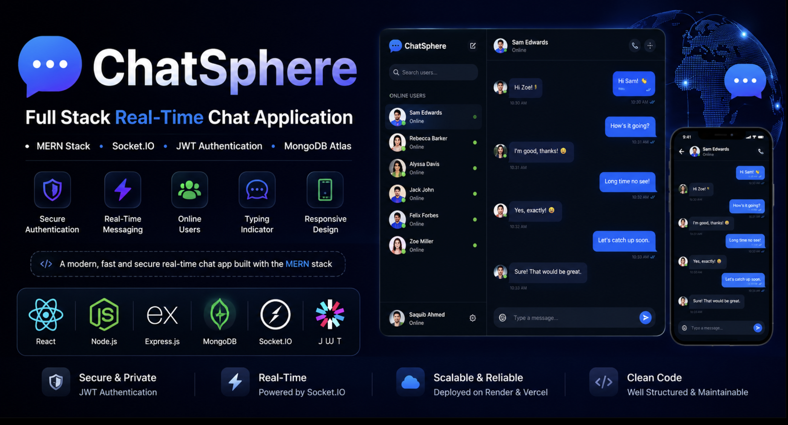

<h1 align="center">💬 ChatSphere</h1>

<h3 align="center">
Full Stack Real-Time Chat Application | MERN Stack | Socket.IO | JWT Authentication | MongoDB Atlas
</h3>

<p align="center">
A modern <b>Full Stack Real-Time Chat Application</b> inspired by <b>iMessage</b>, built using <b>React.js</b>, <b>Node.js</b>, <b>Express.js</b>, <b>MongoDB Atlas</b>, <b>Socket.IO</b>, and <b>JWT Authentication</b>.
</p>

<p align="center">
  
</p>

<p align="center">

<a href="https://chatsphere-pi.vercel.app">

</a>

<a href="https://chatsphere-backend-518s.onrender.com">

</a>


</p>


---

## 🚀 Features

- 🔐 Secure User Authentication (Login & Signup)
- 💬 Real-Time Messaging with Socket.IO
- 🟢 Online / Offline User Status
- ⌨️ Typing Indicator
- 📜 Persistent Chat History
- 👤 User List Management
- 😊 Emoji Support
- ⚡ Fast and Responsive UI
- 🔒 JWT Based Authentication
- 🌐 MongoDB Atlas Database Integration

---

## 🚀 Live Demo

- **Frontend:** https://chatsphere-pi.vercel.app
- **Backend API:** https://chatsphere-backend-518s.onrender.com

## ☁️ Deployment

- **Frontend:** Vercel
- **Backend:** Render
- **Database:** MongoDB Atlas

## 🛠 Tech Stack

### Frontend
- React.js
- Vite
- Tailwind CSS
- Socket.IO Client
- React Router

### Backend
- Node.js
- Express.js
- Socket.IO
- JWT Authentication
- bcrypt

### Database
- MongoDB Atlas
- Mongoose

---

## 📂 Project Structure

```
ChatSphere/
│
├── client/
│   ├── src/
│   ├── public/
│   └── package.json
│
├── server/
│   ├── controllers/
│   ├── models/
│   ├── routes/
│   ├── sockets/
│   ├── middleware/
│   └── server.js
│
├── .gitignore
├── README.md
└── package.json
```

---

## ⚙️ Installation

### Clone Repository

```bash
git clone https://github.com/saquibahmed0882/chatsphere.git
```

### Go to Project

```bash
cd chatsphere
```

### Install Dependencies

#### Client

```bash
cd client
npm install
```

#### Server

```bash
cd ../server
npm install
```

---

## ▶️ Run Application

### Start Backend

```bash
cd server
npm run dev
```

### Start Frontend

```bash
cd client
npm run dev
```

---

## 📸 Screenshots

### 🔐 Login Page


### 📝 Signup Page


### 💬 Chat Interface


### 🟢 Online Users


### ⌨️ Typing Indicator


---

## 🌟 Upcoming Features

- ✅ Message Seen Status
- 📁 File Sharing
- 😊 Emoji Picker
- 🖼 Image Sharing
- 🌙 Dark Mode
- 👥 Group Chat
- 🔔 Notifications
- 🎥 Audio & Video Calling

---

## 👨‍💻 Developer

**Saquib Ahmed**

B.Tech in Artificial Intelligence

GitHub:
https://github.com/saquibahmed0882

---

## ⭐ Support

If you like this project, don't forget to ⭐ the repository.
